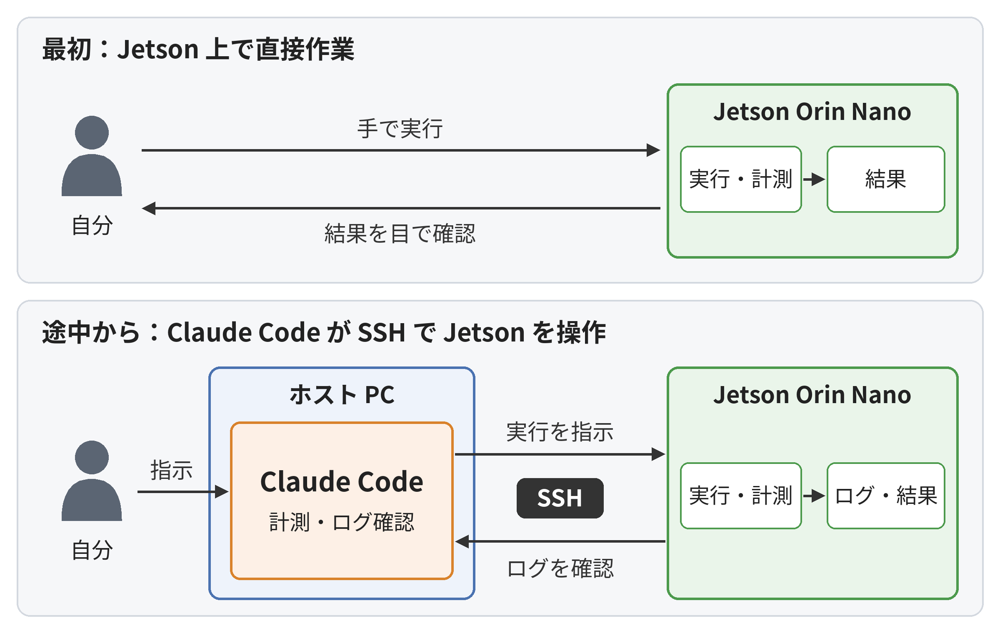

# Claude Code を使った進め方

Jetson Orin Nano 上での計測と改善を進める中で、Jetson を直接操作する方法から、ホスト PC の Claude Code に SSH 経由で操作を任せる方法へ切り替えました。ここでは、その経緯と接続方法をまとめます。

## 作業方法の変更

最初は Jetson を直接操作し、プログラムの実行と計測を行っていました。その後、比較する設定や検証項目が増えてきたため、ホスト PC の VS Code 上で動く Claude Code から、SSH 経由で Jetson を操作する方法に切り替えました。

コードの転送、計測の実行、ログの回収を AI エージェントにまとめて任せ、私は開発方針の決定と、コード・作業結果の確認を行いました。

下図は、この作業方法の変化を示しています。



## 構成

切り替え後は、ホスト PC でコードを編集し、RealSense を使ったプログラムの実行と性能計測は Jetson 上で行いました。

```
ホスト PC(Ubuntu、RTX 5080)
  └─ VS Code + Claude Code
       ├─ PC 上でコードを編集・テスト
       └─ SSH で Jetson を操作(コードの配置、計測の実行、結果の回収)

Jetson Orin Nano + RealSense D435i
```

Claude Code 自体はホスト PC 上で動作し、SSH を通じて Jetson 上のコマンドを実行します。

## SSH 接続の準備

```bash
# ホスト PC で実行する
# 鍵の作成
ssh-keygen -t ed25519 -f ~/.ssh/id_ed25519_jetson -N ""
# 公開鍵を Jetson へ保存
ssh-copy-id -i ~/.ssh/id_ed25519_jetson.pub <user>@<jetson-ip>
```

- **Jetson のパスワードは AI に渡していません。** 会話の記録に残るのを避けるためです。また、AI のコマンド実行ではパスワードを対話的に入力できないため、鍵での接続にしました。
- この鍵は Jetson 専用にし、パスフレーズなしにしています(AI のコマンド実行から使うため)。GitHub 用の鍵とは分けています。

## Claude Code が自律的に行った検証

SSH で接続したあと、Claude Code が Jetson 上で行った確認です。

| 検証 | 内容 | 結果 |
|---|---|---|
| Jetson の状態確認 | 電源モード、GPU クロック、カメラの接続、実行中のプログラムを確認 | MAXN_SUPER、最大クロック、D435i 接続済み |
| エンジンの入力サイズ確認 | `.engine` に記録された入力サイズを読み取り | `[480, 640]`(正しい設定) |
| 試運転 | Jetson に配置したコードを 40 フレームだけ実行 | 正常に終了 |
| 計測①〜③ | 600 フレームずつ実行し、ログを回収して比較表を作成 | [profiling.md](profiling.md) を参照 |
| マスクサイズの警告 | すべての計測ログで `[WARNING]` が出ていないか確認 | 出ていない |
| エラー対応 | エンジンの読み込みエラーのログを確認し、同じ設定で再実行 | 再実行で正常に計測 |
